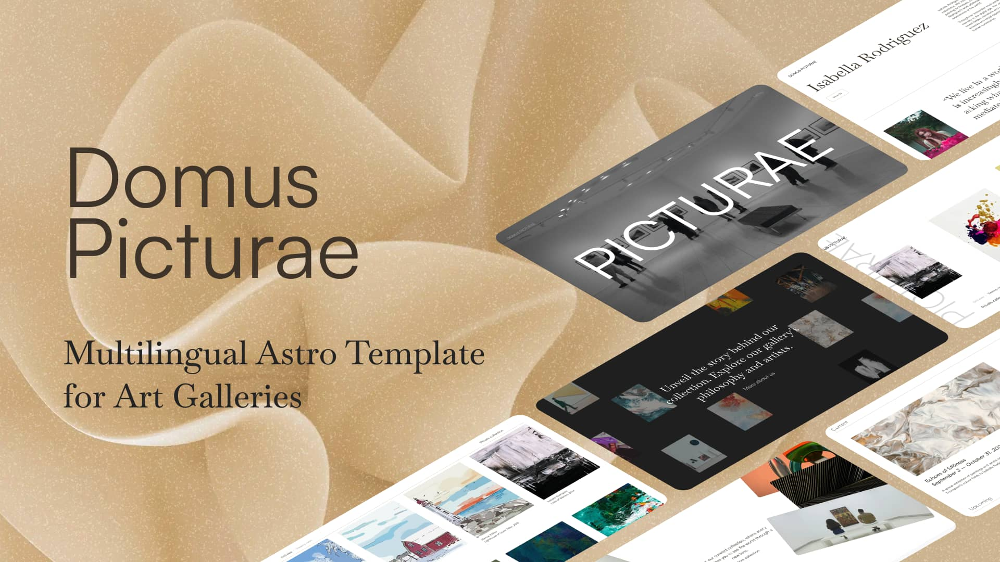

# Multilingual Astro Template for Art Galleries

Domus Picturae is an **open-source website template** for contemporary art galleries: a catalogue of artists and artworks, an immersive viewing room, a private collection, exhibitions, workshops and news – in as many languages as you need. Built with [Astro](https://astro.build/) and [Keystatic CMS](https://keystatic.com/), styled with plain CSS design tokens, and animated with [GSAP](https://gsap.com/) and [Lenis](https://lenis.dev/), it builds to a fully static site that deploys anywhere.

<p align="left">
    <a href="https://domus-picturae.vercel.app" target="_blank">
      </a>
</p>

## Table of Contents

- [Why Choose Domus Picturae?](#why-choose-domus-picturae)
  - [Features](#features)
- [What's New](#whats-new)
- [Getting Started](#getting-started)
  - [Use This Template](#use-this-template)
  - [Clone the Repository](#clone-the-repository)
  - [Installation](#installation)
  - [Development Commands](#development-commands)
- [Deployment](#deployment)
- [Project Structure](#project-structure)
- [Customization](#customization)
  - [Gallery Details](#gallery-details)
  - [Navigation](#navigation)
  - [Design Tokens and Dark Theme](#design-tokens-and-dark-theme)
  - [Forms](#forms)
- [Content Management](#content-management)
  - [Keystatic CMS](#keystatic-cms)
  - [Localised Content](#localised-content)
  - [Artwork Availability](#artwork-availability)
- [Internationalization](#internationalization)
- [Integrations and Enhancements](#integrations-and-enhancements)
- [Documentation](#documentation)
- [Contributing](#contributing)
- [License](#license)

## Why Choose Domus Picturae?

- **Built for galleries:** The content model speaks the language of the art world – artists and estates, artworks with availability, exhibitions, workshops, a viewing room and a private collection.
- **Multilingual from the ground up:** Every piece of text is localised per field, one implementation serves every language, and adding a locale is a documented, mechanical change.
- **Easy content management:** Keystatic edits everything, including per-language bodies and images, without leaving the browser.
- **Deploy anywhere:** Fully static output with no server runtime required.

### Features

- **Astro-powered:** Static site generation with content collections and image optimization.
- **Keystatic CMS:** Local, Git-based editing at `/keystatic` during development.
- **Internationalization (i18n):** Three locales out of the box (English, French, German) on Astro's i18n routing, with typed UI strings and hreflang links.
- **Plain CSS design system:** Tokens as custom properties, cascade layers, component-scoped styles and a token-swap dark theme – no utility framework.
- **GSAP and Lenis:** Smooth scrolling, scroll-driven reveals, a horizontal viewing room and a 3D private-collection scene.
- **Forms:** Newsletter and workshop registration islands (React + react-hook-form + zod) with a honeypot, delivering to Formspree or any webhook — demo mode until configured.
- **SEO:** Per-page metadata, Open Graph, schema.org structured data, sitemap and robots.txt.
- **Quality gates:** Type and content checks, unit specs, Prettier and a CI workflow.

## What's New

> [!NOTE]
> Fully static output, a single plain-CSS styling system, one implementation of every page shared across locales, form delivery through Formspree or any webhook (demo mode until configured), and a content model that generates both the Astro schemas and the Keystatic admin. All demo content is fictional. Report issues on the [issues page](https://github.com/mearashadowfax/DomusPicturae/issues) or [start a discussion](https://github.com/mearashadowfax/DomusPicturae/discussions/new/choose).

## Getting Started

This guide will provide you with the necessary steps to set up and familiarize yourself with the project on your local development machine.

### Use This Template

Click the `Use this template` button at the top right of the repository to create your own repo based on this template.

### Clone the Repository

Once your repository is created, you can clone it to your local machine using the following commands:

```bash
git clone https://github.com/[YOUR_USERNAME]/[YOUR_REPO_NAME].git
cd [YOUR_REPO_NAME]
```

### Installation

Start by installing the project dependencies. Open your terminal, navigate to the project's root directory, and execute:

```bash
pnpm install
```

### Development Commands

With dependencies installed, you can utilize the following pnpm scripts to manage your project's development lifecycle:

- `pnpm dev`: Starts the development server with the Keystatic admin at `/keystatic`.
- `pnpm build`: Builds the static site into `dist/`.
- `pnpm preview`: Serves the built site locally.
- `pnpm check`: Type-checks components and validates every content entry.
- `pnpm test`: Runs the unit specs (Vitest).
- `pnpm format:fix` / `pnpm format:check`: Prettier fixes and checks.

> [!TIP]
> Need more details? Check out [Astro's documentation](https://docs.astro.build/en/reference/cli-reference/).

## Deployment

Domus Picturae builds to a fully static site with no adapter, so it deploys to Vercel, Netlify, Cloudflare Pages, GitHub Pages or any web server. Set the canonical URL in `astro.config.mjs` (`site`) and `src/data/constants.ts` first, and optionally the two form variables from `.env.template` in your host's build environment.

Click the button below to start deploying your project on Vercel:

[](https://vercel.com/new/clone?repository-url=https%3A%2F%2Fgithub.com%2Fmearashadowfax%2FDomusPicturae)

> [!NOTE]
> The Keystatic admin needs server routes, so it is only included while running `pnpm dev`; production builds are static. To edit content from a hosted admin, add an SSR adapter and switch Keystatic to GitHub storage as described in [`docs/deployment.md`](docs/deployment.md).

`vercel.json` only adds HTTP security headers and is ignored by other hosts.

## Project Structure

```text
src/
├── assets/
│   ├── images/          Images referenced by content (Keystatic uploads go here)
│   ├── scripts/         Smooth scrolling and the GSAP motion module
│   └── styles/          Design tokens, base styles, shared form styles
├── components/
│   ├── forms/           React islands (newsletter, workshop registration)
│   ├── sections/        Page sections and cards, grouped by area
│   └── ui/              Icons, language switcher, slider, cursor
├── content/             Editorial content, one folder per collection
├── content-model/       The content model: one description generates Zod + Keystatic
├── content.config.ts    Astro collections, generated from the model
├── data/                Build-time constants
├── i18n/                Locale list and UI strings per locale
├── layouts/             The page shell
├── pages/               Routes: thin files per locale that render a view
├── routes.ts            Every URL the site serves: hrefs and getStaticPaths helpers
├── utils/               Content, image and formatting helpers
└── views/               One component per page type, shared by every locale
```

## Customization

### Gallery Details

The gallery name, tagline, address, contact details, social links and footer credit live in the **Site settings** singleton in Keystatic (`src/content/site/index.json`). The demo ships with the template author's name in the `creditName` / `creditUrl` fields; replace them with your own or clear them to hide the credit. Build-time values – the canonical URL, sharing image and theme colour – are in `src/data/constants.ts` and `public/site.webmanifest`.

### Navigation

Menu and footer entries are ordered lists in `src/routes.ts`; their labels live with the other UI strings in `src/i18n/ui.ts`, one set per locale, so adding a language never touches the navigation itself.

### Design Tokens and Dark Theme

Colours, radius and motion curves are custom properties in `src/assets/styles/variables.css`. Sizes scale with the viewport through `--unit-fx` (`calc(24 * var(--unit-fx))` for a 24px design value). A page renders on the dark palette by passing `theme="dark"` to the layout; only tokens change. See [`docs/css-architecture.md`](docs/css-architecture.md).

### Forms

The newsletter and workshop forms post JSON to the endpoints in `PUBLIC_FORM_NEWSLETTER` and `PUBLIC_FORM_WORKSHOP` (a Formspree form or any JSON webhook). Unset, they run in demo mode and log the submission instead, so a fresh clone works before any service exists; see [`docs/forms.md`](docs/forms.md).

## Content Management

### Keystatic CMS

Run `pnpm dev` and open `http://localhost:4321/keystatic`. Keystatic runs in `local` storage mode and edits the files under `src/content/` directly, so content changes are committed with the rest of the code. Switch `KEYSTATIC_STORAGE_MODE` in `keystatic.config.ts` to `"github"` for hosted editing.

The content model is defined once in `src/content-model/collections.ts`; `src/content.config.ts` (Astro schemas) and `keystatic.config.ts` (admin UI) are generated from it.

### Localised Content

Every free-text field is stored as one object with a key per locale:

```json
"title": { "en": "The Blue Interval", "fr": "L'intervalle bleu", "de": "Das blaue Intervall" }
```

Images, dates, numbers and slugs are shared. Long-form entries (news, exhibitions, workshops, pages) keep a Markdown body per language in `body/<locale>.md`. See [`docs/content.md`](docs/content.md).

### Artwork Availability

An artwork is `available`, `sold` or `not-for-sale`. Available and sold works appear in the catalogue and viewing room; works that are not for sale form the private collection, shown on the dark theme.

## Internationalization

The locale list in `src/i18n/config.ts` is the single source of truth: `astro.config.mjs`, the content schemas, the Keystatic admin and every component read from it. Each page exists once in `src/views/` and is rendered by a thin route file per locale in `src/pages/`, so `src/pages/` still shows every URL the site serves. Adding a language is a six-step change described in [`docs/i18n.md`](docs/i18n.md).

## Integrations and Enhancements

- **[Astro SEO](https://github.com/jonasmerlin/astro-seo)** and **[Astro SEO Schema](https://github.com/codiume/orbit/tree/main/packages/astro-seo-schema)** for metadata and structured data; the JSON-LD shapes live in `src/utils/seo.ts`.
- **Astro Fonts** to self-host Satoshi (Fontshare) and Baskervville (Google Fonts) — fetched at build time and served from `/_astro/fonts/`, so visitors never contact a third-party font CDN.
- **[GSAP](https://gsap.com/)** with ScrollTrigger and SplitText for reveals and scroll-driven scenes.
- **[Lenis](https://lenis.darkroom.engineering/)** for smooth scrolling, synced with ScrollTrigger.
- **[@astrojs/sitemap](https://docs.astro.build/en/guides/integrations-guide/sitemap/)** with per-locale entries.
- **[Keystatic](https://keystatic.com/)** with localised fields generated from the locale list.

## Documentation

| Guide                                                | What it covers                                                   |
| ---------------------------------------------------- | ---------------------------------------------------------------- |
| [docs/content.md](docs/content.md)                   | The content model, localised fields, adding a content type       |
| [docs/i18n.md](docs/i18n.md)                         | Locales, UI strings, navigation labels, adding a language        |
| [docs/css-architecture.md](docs/css-architecture.md) | Tokens, layers, component styles, the dark theme                 |
| [docs/forms.md](docs/forms.md)                       | Wiring the newsletter and workshop registration forms            |
| [docs/deployment.md](docs/deployment.md)             | Static hosting, the Vercel demo, running Keystatic in production |
| [CONTEXT.md](CONTEXT.md)                             | Glossary of the terms used in code and content                   |

## Contributing

Contributions are welcome. Open an issue for bugs or proposals, or submit a pull request; CI runs formatting, type/content checks and a full build on every PR. See [CONTRIBUTING.md](CONTRIBUTING.md) for the workflow and [SECURITY.md](SECURITY.md) for reporting vulnerabilities.

## License

This project is released under the MIT License. Please read the [LICENSE](LICENSE) file for more details.
